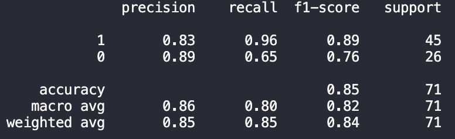
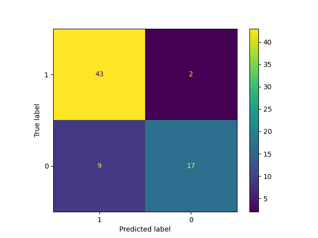
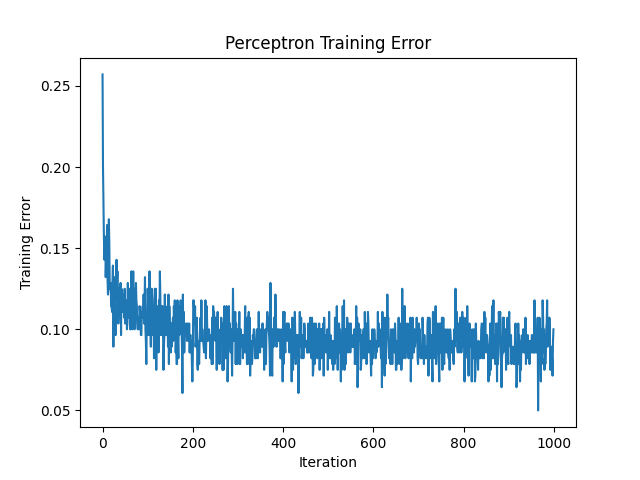
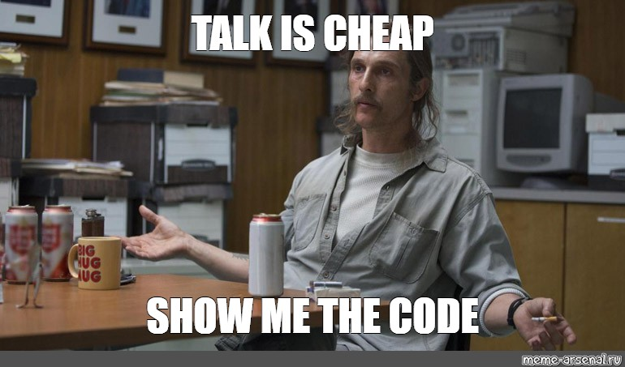
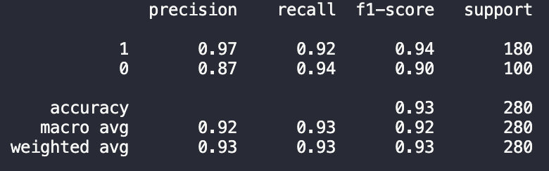
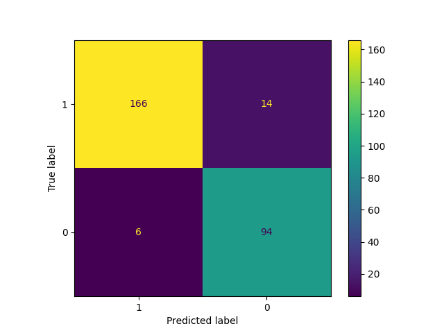

# Perceptron Algorithm

## I judge my algorithm by the following metrics:
-------------------------------------------------

| Metric | Definition |
| ----------- | ----------- |
| Precision | The proportion of correct positive predictions divided by total positive predictions. |
| Recall | The number of correct positive predictions divided by the number of positive occurances. |
| F1-Measure | A combination of precision and recall, calculated as a harmonic mean. |
| Accuracy | The number of correct predictions divided by the number of total predictions made by the algorithm. |

<br/><br/>
The data utilized in this project can be found [here](https://archive.ics.uci.edu/ml/datasets/Ionosphere). The title is "Johns Hopkins University Ionosphere database" and was donated by Vince Sigillito in 1989.


- There are 351 instances
- 35 attributues (continuous)
    - 34 continuous & 1 class attribute 
- The class attribute is either classified as "good" or "bad"
- There are no missing values 
- The purpose of this project is to build a model that can classify similar data as either "good" or "bad"

<br/><br/>
## Scores of the Test data

| Metric | Scores (Positive Labels) |
| ----------- | ----------- |
| Precision | 83% |
| Recall | 96% |
| F1-Measure | 89% |
| Accuracy (All Labels) | 85% |


The scores above suggest that my algorithm has the ability to determine true positives, but also tends to declare false postives. I am very proud of this model and all the work I put into it!


<br/><br/>
## Confusion Matrix


<br/><br/>
## Training Errors



The first two hundred iterations have the most growth in terms of becoming more accurate with every consecutive iteration.

---------------------------------
<br/><br/>


These are the imports I utilized for this project
```
import pandas as pd 
import numpy as np 
import matplotlib.pyplot as plt
from sklearn.metrics import ConfusionMatrixDisplay 
from sklearn.model_selection import train_test_split
from sklearn.preprocessing import LabelEncoder
from sklearn.metrics import classification_report
```
Below is the code I used to create the numpy arrays of data used in this example.
```
dataset = df.values # making the df into a numpy array
X = dataset[:,0:34].astype(float) # making x the contiuous data
print(X) # see how it worked
Y = dataset[:,34]
print(Y) # see how it worked
encoder.fit(Y) # creates the mapping
Y = encoder.transform(Y) # implements the mapping
print(Y) # see how it worked
```
---------------
## Scores of the Training data
### After analyzing the results of the test data, I ran the predict() method on the training data. 

| Metric | Scores (Positive Labels) |
| ----------- | ----------- |
| Precision | 97% |
| Recall | 92% |
| F1-Measure | 94% |
| Accuracy (All Labels) | 93% |



<br/><br/>
## Confusion Matrix



-----------------------------
<br/><br/>
The scores above suggest that the model is overfit. This means that the model is too specialized in its training on the available data, which can result in it being less effective when presented with new or test data. This has a significant impact on theusefulness of the model, because it is biased towards the training data rather than other data sets. The degree to which this affects the model's usefulness will depend on its intended application and required level of accuracy. While the above scores obtained from testing data may be subperb for certain purposes, they may be deemed unacceptable for others.
